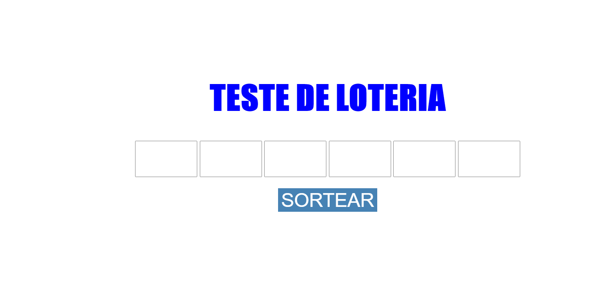

# Simulador de Loteria

Este projeto é um simulador da *megasena* onde o usuário digita seis numeros e sorteiamos aleatoriamente outros 6 números e comparamos para verificar quantos numeros você acertou.


**OBS: Não é um simulador real**

## Tecnologias utilizadas
1. **HTML**: HTML (abreviação para a expressão inglesa HyperText Markup Language, que significa Linguagem de Marcação de Hipertexto) é uma linguagem de marcação utilizada na construção de páginas na Web.
2. **CSS**: Cascading Style Sheets (CSS) é um mecanismo para adicionar estilo (cores, fontes, espaçamento, etc.) a um documento web.
3. **JAVASCRIPT**: JavaScript (frequentemente abreviado como JS) é uma linguagem de programação interpretada estruturada, de script em alto nível com tipagem dinâmica fraca e multiparadigma (protótipos, orientado a objeto, imperativo e, funcional).
4. ~~**JQUERY**~~: Não foi utilizado.

## Funções Principais
Aqui será apresentado as duas funções principais do site

### Sorteio de números
Nessa função os números são sorteados aleatoriamente
```
function sortearNumeros(){
numSort = [];
let sort;
for (var i = 0; i < 6; i++) {
do {
sort = Math.ceil(Math.random() * 60);
sort = (sort == 0) ? 1 : sort;
} while(numSort.includes(sort));
numSort.push(sort);
}
}
```

### Lendo os números digitados
Lê as entradas de números digitadas pelo usuário
```
function addToList(num, pos) {
if (num.length == 2) {
if (numEsco.includes(num)) {
alert("Número escolhido anteriormente :( Digite outro numero: ")
}else if(parseInt(num) > 60){
alert("O número digitado não pode ser maior que 60!!");
 }else{
numEsco[pos -1] = num;
}
}
}
```
## Como rodar o código
> Simplesmente baixe o código e abra o arquivo **_index.html_** no seu navegador

## Exemplo de tabela

Exemplo  |  Valor do exemplo  |
-------- | -------------------|
Exemplo 1| R$ 10
Exemplo 2| R$ 12
Exemplo 3| R$ 8

## Imagens da tela
Tela 1


#### Referências
* HTML: [Wikipedia](https://pt.wikipedia.org/wiki/HTML)
* CSS: [w3Shools](https://pt.wikipedia.org/wiki/Cascading_Style_Sheets)
* JavaScript: [JS](https://pt.wikipedia.org/wiki/JavaScript)
